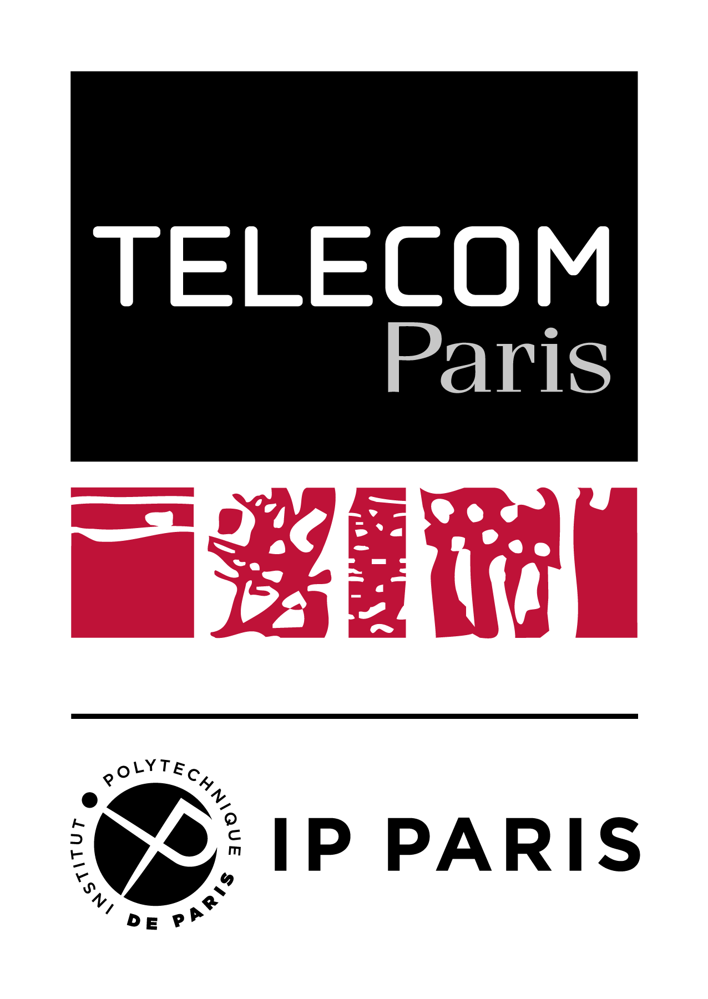

# Tramex project



Tramex is a university project conducted in Télécom Paris supervised by Philippe Martins

Tramex is a project that serves the goal of allowing users to analyze and visualize frames in a 4G network.

Tramex is a project derived from:

- VIGIE
- Amarisoft web interface

## VIGIE

One of the functionalities of the VIGIE software is to analyze the frames of a 2G/3G network. For more information on this topic, please visit <https://hal.science/hal-02141173>.

Tramex can be seen as an upgrade of the VIGIE software because it allows the user to analyze the frames of a 4G network. Note that Tramex does not have all the functionalities implemented in the VIGIE software.

<details>

<summary>VIGIE Citation</summary>

```bibtex
@article{oyedapo:hal-02141173,
  TITLE = {{VIGIE : A learning tool for cellular air interfaces (GSM, GPRS, UMTS, WiFi)}},
  AUTHOR = {Oyedapo, Olufemi and Martins, Philippe and Lagrange, Xavier},
  URL = {https://hal.science/hal-02141173},
  JOURNAL = {{The IPSI BgD Transactions on Internet Research}},
  HAL_LOCAL_REFERENCE = {1097},
  VOLUME = {1},
  NUMBER = {2},
  PAGES = {65 - 69},
  YEAR = {2005},
  KEYWORDS = {UMTS},
  HAL_ID = {hal-02141173},
  HAL_VERSION = {v1},
}
```

</details>

## Amarisoft web interface

Amarisoft is a software company that provides a 4G LTE software suite. The web interface of Amarisoft lets the user visualize the frames of a 4G network. This tool uses a Websocket to retrieve the frames transmitted within the network.

## Tramex

> Tramex stands for **Tram**e **Ex**ploration.
> As it is a French project, "Trame" is the French word for "Frame" and "Exploration" can be read either in French or in English.

Based on the **Amarisoft** software, Tramex uses the same WebSocket method to retrieve the frames transmitted within the network, but it displays them in a more user-friendly manner, similarly to the **VIGIE** software.
